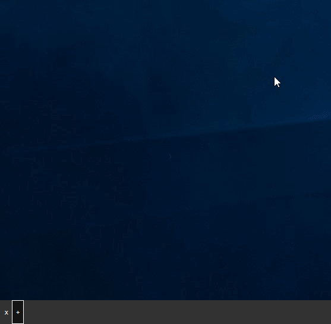

 
# Spar Focused Task Bar

A replacement for default Windows shell task bar.

## Main idea
Leave windows you want for now. No needs in searching for needed window in Alt+Tab, just add icon when you need it and remove when done.

This program was made originally from [DeeShell by pravin](https://github.com/pravin/deeshell)

## Features:
- You can close SparTask (wow)
- Add app
- Switch to app
- Rearrange icons positions (Shift + LMB)
- Remove app from SparTask (RMB)
- Kill app (RMB)
- Time and date
- Language display
- Minimize/Unminimize all
- If app was closed icon will be removed too

## Problems:
- Some non-windowed apps can be in a list (idk how to get rid of them, why does Calculator run on my PC when I didn't opened it)
- You won't see the icons from right side of legacy task bar (Wi-Fi icon, Notification panel, Calendar, Flash drive remove, etc)
- SparTask uses app's icons from their **.exe**. So Discord icon will not have any notification badges. 

## Installation:
- Download from [releases](https://github.com/GitSparTV/SparTask/releases)
- Run (administrator required)

## Notes for manual builders:
- Made in VS 2019
- .NET 4
- My screen is 2560 in width so check width settings if you have something wrong
- References: PresentationCore, System, System.Data, System.Drawing, System.Management, System.Windows.Forms, WindowsBase

## Demo
 